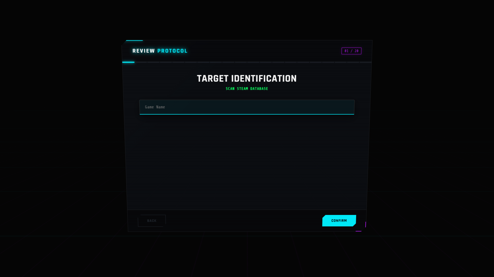
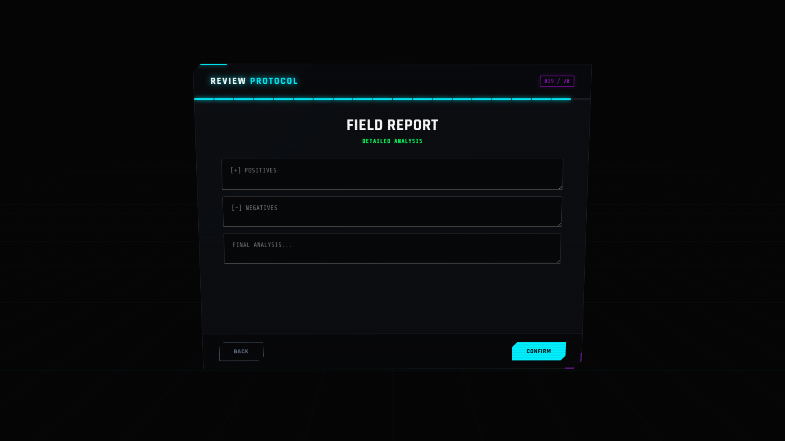
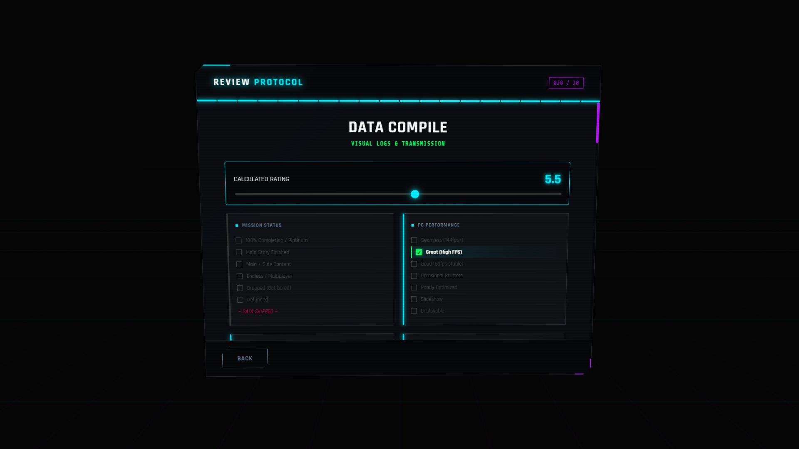

# 🌌 Review OS - The Ultimate Steam Review Generator


**Review OS** is a futuristic, holographic web application designed to help gamers create professional, perfectly formatted **Steam Reviews**. It features a 3D tilting interface, automatic rating calculation, and deep customization options.

---

## 🚀 [**Launch Live App**](https://dalbouh02.github.io/Review-OS/)

---

## ✨ Key Features

### 🖥️ Holographic Interface
*   **3D Tilt FX:** The UI physically tilts in 3D space as you move your mouse.
*   **Cyberpunk Aesthetics:** Neon glows, scanlines, and a moving mesh background.
*   **Typewriter Engine:** Text types out dynamically like a terminal.

### 🔍 Smart Game Search
*   **Steam Database Integration:** Instantly search for any game on Steam.
*   **Auto-Fetch:** Grabs the official game cover art and AppID.
*   **No API Key Needed:** Uses a secure proxy to fetch data directly.

### 📝 Review Generation
*   **20+ Categories:** Rate everything from Graphics and Audio to Monetization and Community.
*   **Visual Log:** See a visual summary of your choices before generating.
*   **BBCode Export:** Generates formatted code ready to paste into Steam.
*   **Auto-Rating:** Automatically calculates a score (e.g., 8.5/10) based on your positive/negative choices.

### 🛠️ Developer Console
*   **Direct Support:** Built-in links to GitHub, Steam, and Twitch.
*   **Trade Offer Integration:** One-click copy/open for gifting.

---

## 📸 Screenshots

| Start Screen | Selection Menu |
| :---: | :---: |
|  |  |

| Visual Report | Final Output |
| :---: | :---: |
|  |  |

---

## 🛠️ How to Use

1.  **Launch the App:** Open the [Live Link](https://dalbouh02.github.io/Review-OS/).
2.  **Search Game:** Type the name of the game you are reviewing.
3.  **Select Options:** Go through the categories (Graphics, Gameplay, etc.) and pick the options that match your experience.
4.  **Write Verdict:** Add your Pros, Cons, and a Summary.
5.  **Generate:** Click **Finish** to see your Visual Report.
6.  **Copy & Paste:** Click **Copy to Clipboard** and paste it into the Steam Review box.

---

## 📦 Installation (Local)

If you want to run this locally or modify it:

1.  Clone the repo:
    ```bash
    git clone https://github.com/Dalbouh02/Review-OS.git
    ```
2.  Navigate to the folder:
    ```bash
    cd Review-OS
    ```
3.  Open `index.html` in your browser. No server required!

---

## 👨‍💻 Credits

**Made By:** Anonymous (Dalbouh02)

*   [GitHub Profile](https://github.com/Dalbouh02)
*   [Steam Profile](https://steamcommunity.com/profiles/76561198306554804/)
*   [Twitch Channel](https://www.twitch.tv/anonymoususernoone)

---

## 🎁 Support

If you like this tool, consider sending a trade offer or a gift on Steam!

[**>> Send gifts <<**](https://steamcommunity.com/tradeoffer/new/?partner=346289076&token=AtneZynY)

---

*Made with ❤️ for the Steam Community.*
